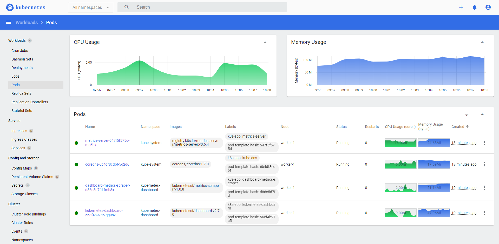
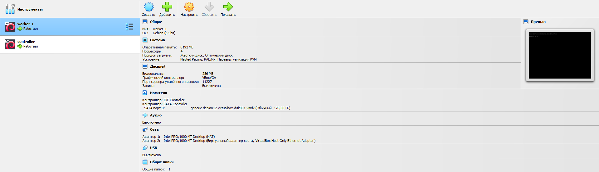
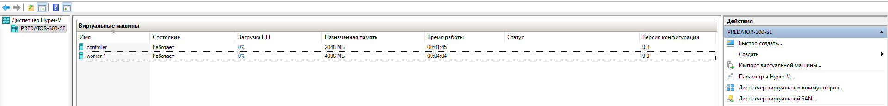
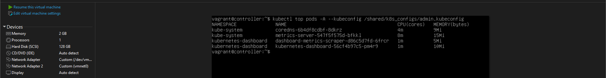

# kubernetes-the-hard-way-automation
Inspired by the Kelsey Hightowers repository - kubernetes-the-hard-way

# how-to
* install `Vagrant`
* install vagrant reload plugin `vagrant plugin install vagrant-reload` for Hyper-V deployment
* install vagrant vmware desktop plugin `vagrant plugin install vagrant-vmware-desktop` for vmWare deployment
* add `secrets.yaml` file to root folder of the project
* execute `vagrant up` command from project root folder

# secrets.yaml
* `username: "smb_username"`        # for Hyper-V deployment
* `password: "smb_password"`        # for Hyper-V deployment
* `k8s_encrypt_key: "strong_key"`
* `etcd_token: "strong_token"`
* `dashboard_token: "strong_token"`

# apps versions info
* `K8S_VERSION 1.30.0`
* `RUNC_VERSION 1.1.12`
* `CNI_VERSION 1.0.0`
* `CONTAINERD_VERSION 1.7.15`
* `ETCD_VERSION 3.5.13`
* `CFSSL_VERSION 1.6.5`
* `HELM_VERSION 3.14.4`

# screenshots

  

