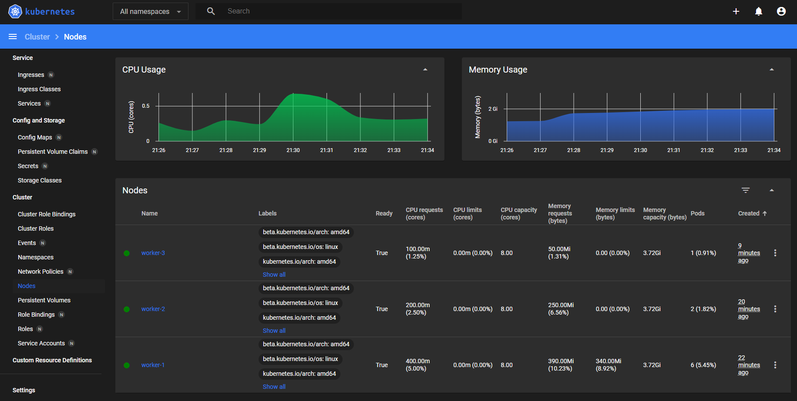
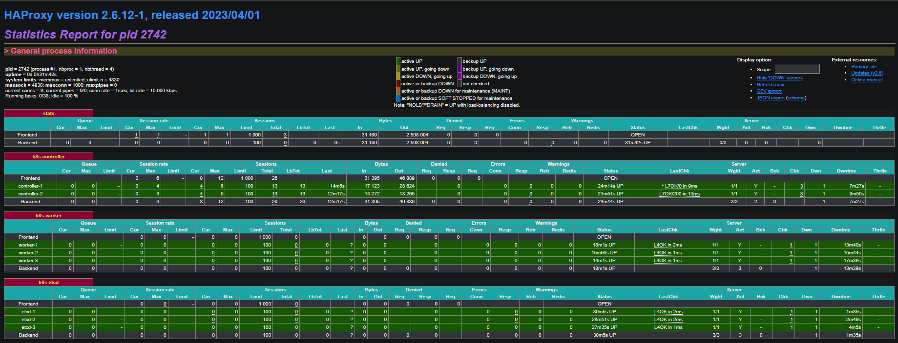
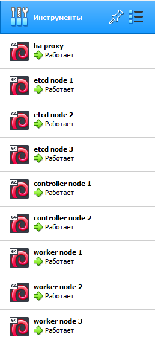

# kubernetes-the-hard-way-automation
Inspired by the Kelsey Hightowers repository - kubernetes-the-hard-way

# how-to
* install `Vagrant`
* install vagrant reload plugin `vagrant plugin install vagrant-reload` for Hyper-V deployment
* create file `secrets.yaml`
* execute `vagrant up` command from project root folder

# secrets.yaml
* `# secrets for Hyper-V deployment`
* `username: "uername"`
* `password: "password"`
* `switch_name: "net-name"`
* `# secrets for all types of deployments`
* `k8s_encrypt_key: "strong-key"`

# apps versions info
* `K8S_VERSION 1.28.0`
* `RUNC_VERSION 1.1.10`
* `CNI_VERSION 1.0.0`
* `CONTAINERD_VERSION 1.7.11`
* `ETCD_VERSION 3.5.11`
* `CFSSL_VERSION 1.6.4`
* `HELM_VERSION 3.13.3`

# addons versions info
* `COREDNS_VERSION 1.9.4`
* `METRICS_SERVER_VERSION 0.6.4`
* `KUBERNETES_DASHBOARD_VERSION 2.7.0`

# screenshots

  
